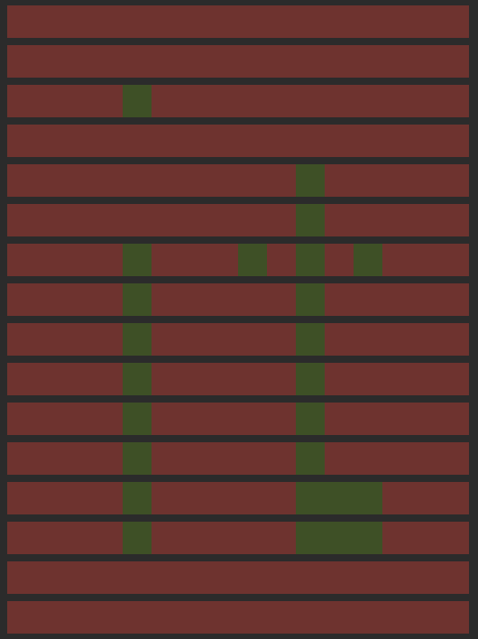

# Images to char on Java

### Task

Task is to implement functionality that prints a two-colored image in the console.

### Project compilation:
For successful compilation, the target folder, resources and libraries must be present

    mkdir ./target ./target/com
    cp -r src/resources target/.
    cd target ; jar xf ../lib/JColor-5.5.1.jar com ; jar xf ../lib/jcommander-1.82.jar com ; cd ..

### To compile the program, enter in CMD:

    javac  -cp ".:./lib/JColor-5.5.1.jar:./lib/jcommander-1.82.jar"  -d ./target/ src/java/edu.school21.printer/*/*.java

### To create an archive, use the command

    jar cvfm ./target/images-to-chars-printer.jar src/manifest.txt -C target .

### Usage: Specify a character for "--white=", "--black="

    java -jar ./target/images-to-chars-printer.jar --white=RED --black=GREEN

For the lazy, use **run.sh** , which will execute all these commands for you

### Preview

